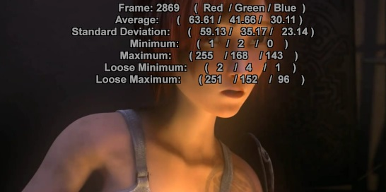

RGBAdjust
=========

Description
-----------

RGBAdjust has many different methods of changing the color and luminance of your RGB clips. 
Gain, bias (offset) and gamma can be set independently on each channel. 
Also included are an analysis function and a dither option.

All settings for this filter are optional. ColorYUV works in a similar manner for YUV clips.

All RGB and RGBA color formats are supported.

This filter multiplies each color channel with the given value, adds the
given bias offset then adjusts the relevant gamma, clipping the result at 0
and 255 (8 bit case).

.. rubric:: Syntax and Parameters

::

    RGBAdjust (clip, float "r", float "g", float "b", float "a", 
    float "rb", float "gb", float "bb", float "ab", 
    float "rg", float "gg", float "bg", float "ag", 
    bool "analyze", bool "dither", bool "conditional", bool "condvarsuffix")

.. describe:: float r, g, b (default 1.0): 

  Red, green and blue scaling factor. Range 0.0 to 255.0 
  For example, r=3.0 multiplies the red channel pixel values by 3. 
  Avisynth+ autoscales – works without changes at all bit depths, gain is bit depth independent.

.. describe:: float a (default 1.0): 

  Alpha adjustment - the transparency information on a per-pixel basis. 
  An alpha value of zero represents full transparency, and a value of 1 represents a full opacity. 

.. describe:: float rb, gb, bb, ab (default 0.0): 

  Bias adjustment—add a fixed positive or negative value to a channel's pixel values. For example, 

  * rb=16 will add 16 to all red pixel values and 
  * rb=-32 will subtract 32 from all red pixel values. 
  
  This parameter is *not* bit depth autoscaled – caller must scale arguments by 4 for 10-bit, etc. 

.. describe:: float rg, gg, bg, ag (default 1.0): 

  Gamma adjustment—an exponential gain factor. For example, 
  
  * rg=1.2 will brighten the red pixel values and 
  * gg=0.8 will darken the green pixel values. 

.. describe:: bool analyze = false: 
  
  If true, RGBAdjust will print color channel statistics on the screen (see example below)

  * There are Maximum and Minimum values for all channels.
  * There is an Average and a Standard Deviation for all channels.
  * There is Loose Minimum and Loose Maximum which ignore the brightest and darkest 0.4% (1/256) pixels. 

    AVS+ parameter is supported for 32 bit float color spaces as well, but loose min/max is based on a 16-bit
    quantized data (loose min/max is based on an internal histogram).

.. describe:: bool dither = false

  When set to true, `ordered dithering`_ is applied when doing the adjustment.
  Parameter is ignored for 32 bit float color spaces 

.. describe:: bool  conditional = false

  If true, the global variables "rgbadjust_xxx" with xxx = 
  * ``r``, ``g``, ``b``, ``a``, 
  * ``rb``, ``gb``, ``bb``, ``ab``, 
  * ``rg``, ``gg``, ``bg``, ``ag``

  are read each frame, and applied. 
  
  It is possible to modify these variables using FrameEvaluate or ConditionalReader. (functionality similar to ColorYUV) 

.. describe:: string condvarsuffix = ""

  This parameter works similarly in ColorYUV, RGBAdjust, Overlay, ConditionalReader. 
  Allows multiple filter instances to use differently named conditional parameters, thus preventing collision and overwrite 
  of variables which are used by different ConditionalReader instances. 
  See :ref:`Conditional Variables <conditional-variables>` section.

  In the matching ConditionalReader one have to use the modified name as well: 

::

    ConditionalReader("coloryuvoffset.txt", "coloryuv_gain_y", false, CondVarSuffix = "_a") # "_a" is added here by parameter
    ConditionalReader("rgbfix.txt", "rgbadjust_r", false, CondVarSuffix = "_1") # "_1" is added here by parameter
    ConditionalReader("rgbfix2.txt", "rgbadjust_r", false, CondVarSuffix = "_2") # "_2" is added here by parameter
    
or specify the suffixed name directly: 

::

    ConditionalReader("coloryuvoffset.txt", "coloryuv_gain_y_a", false) # "_a" is added here manually

Notes
-----

All arguments default—leaves the clip untouched: 

::

    RGBAdjust (1, 1, 1, 1, 0, 0, 0, 0, 1, 1, 1, 1) leaves

Keep in mind ALL the values are not scaled to accomodate changes to one (for
that you should use Levels) so doing something like:

::

    RGBAdjust(2, 1, 1, 1)

will get you a whole lot of clipped red. If you WANT a whole lot of clipped
red, there you go - but if you want MORE red without clipping you should do

::

    Levels(0, 1, 255, 0, 128).RGBAdjust(2, 1, 1, 1)

This would scale all the levels (and average lum) by half, then double the
red. Or more compact

::

    RGBAdjust(1.0, 0.5, 0.5, 1.0)

This leaves the red and halves the green and blue.

To invert the alpha channel

::

    RGBAdjust(a=-1.0, ab=255)

Thus alpha pixels values become a=(255-a)

Example
-------

* Demonstrating analyze output: 

::

    FFmpegSource2("sintel.mp4")
    ConvertToRGB32
    BicubicResize(546, 272)
    RGBAdjust(analyze=true)

Changes
-------

+------------+----------------------------------------+
| Changelog: |                                        |
+============+========================================+
| 3.7.1      | analyze for 32bit float color spaces   |
+------------+----------------------------------------+
| r2915      | Added condvarsuffix                    |
+------------+----------------------------------------+
| r2724      | | Added 32 bit float.                  |
|            | | Added conditional                    |
+------------+----------------------------------------+
| v2.56      | Added offsets, gamma, analyze.         |
+------------+----------------------------------------+
| v2.60      | Added dither.                          |
+------------+----------------------------------------+

$Date: 2026-01-27 12:30:00 $

.. _ordered dithering: http://avisynth.nl/index.php/Ordered_dithering
