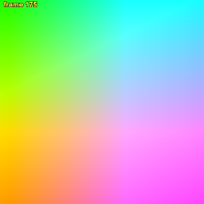
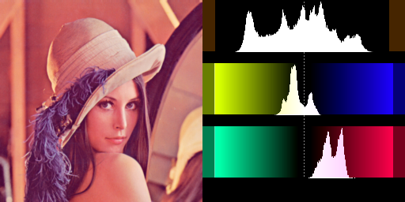
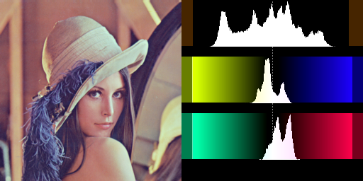
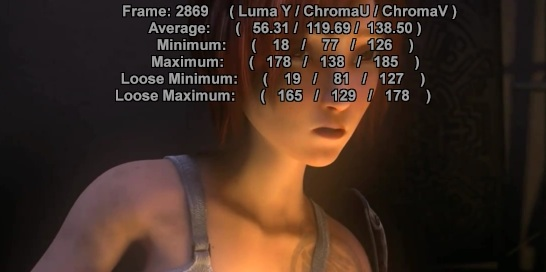

ColorYUV
========

Description
-----------

``ColorYUV`` has many different methods of changing the color and luminance 
of your images. Gain, offset, gamma and contrast can be set independently on 
each channel. Also included are two 'auto' modes, an analysis function and a 
color gamut generator.

All settings for this filter are optional. All values are defaulting to "0" or false. 
gain,  off,  gamma and cont can be set independent on each channel.

:doc:`RGBAdjust <adjust>` works in a similar manner for RGB clips. 

* In AviSynth 2.6, all YUV color formats are supported (Y8, YV12, YV16, YV24, YV411 and YUY2)
* AVS+ all YUV and YUVA color formats are supported, including Float.
* AVS+ all relevant parameters are autoscaling – they work without changes at all bit depths as
  they worked for 8 bit formats.

**Frame properties**

`_ColorRange` property is not set to "full" if input has no such
property and range cannot be 100% surely established. In general: when no `_ColorRange` for input and 
no parameter which would rely on a supposed default (such as full range for gamma), then an
output frame property is not added.
When no `_ColorRange` for input and no other parameters to hint color range then 

- `gamma<>0` sets full range
- `opt="coring"` sets limited range
- otherwise no `_ColorRange`   for output would be set

ColorYUV sets `_ColorRange` frame property:

* levels = "TV->PC" -> full
* levels = "PC->TV" or "PC->TV.Y" or "TV" -> limited
* levels = (not given) and _ColorRange property exists -> keeps _ColorRange 
* levels = (not given) and no _ColorRange property  -> full range (old default behaviour)

When no hint is given by parameter "levels" then use _ColorRange (limited/full) frame property 
for establishing source range If _ColorRange does not exist, it treats input as full range 
(old default behaviour, gamma-only setting can be changeable with levels="TV")

Why: when there is no limited<->full conversion, but gamma is provided then this info is still 
used in gamma calculation.

.. rubric:: Syntax and Parameters

::

    ColorYUV (clip, 
    float "gain_y", float "off_y", float "gamma_y", float "cont_y", 
    float "gain_u", float "off_u", float "gamma_u", float "cont_u",
    float "gain_v", float "off_v", float "gamma_v", float "cont_v",
    string "levels", string "opt", 
    boolean "showyuv", boolean "analyze", boolean "autowhite",
    boolean "autogain", boolean "conditional",
    int "bits", bool "showyuv_fullrange", bool "f2c", string "condvarsuffix")

.. describe:: float gain_y, gain_u, gain_v

  gain_x is a multiplier for the Y, U or V value, and it stretches the signal up from the bottom.
  
  If `gain_y` = `k`, then `Y` becomes `Y * (k / 256 + 1)` – for example:
  
  (TL;DR see :ref:`Parameter Rescaling <parameter-rescaling>` below) 

   +--------+------------------+---------------------------------------+
   | gain_x |                  | multiplier                            |
   +--------+------------------+---------------------------------------+
   |  -256  | (-256 / 256) + 1 | 0.0 (no output)                       |
   +--------+------------------+---------------------------------------+
   |  -128  | (-128 / 256) + 1 | 0.5 (darker)                          |
   +--------+------------------+---------------------------------------+
   |     0  | (   0 / 256) + 1 | 1.0 (no change)                       |
   +--------+------------------+---------------------------------------+
   |   256  | ( 256 / 256) + 1 | 2.0 (brighter)                        |
   +--------+------------------+---------------------------------------+
   |   512  | ( 512 / 256) + 1 | 3.0                                   |
   +--------+------------------+---------------------------------------+

  * `gain_x` is valid down to -256, where a gain of 0.0 is applied.
  * Although it is possible, it doesn't make sense to apply this setting to the chroma of the signal.
  * In order to confuse you, in the filter :doc:`Tweak <tweak>` this setting is called contrast.

.. describe:: float off_y, off_u, off_v

  Offset. Adds a value to the luma or chroma values. 
  
  * An `off_x` of 16 will add 16d to all pixel values.
  * An `off_x` of -32 will subtract 32d from all pixel values. 
  
(The `d` suffix means the value must be interpreted as bit-depth scaled.)

.. describe:: float gamma_y (,gamma_u, gamma_v)

  Adjusts gamma of the specified channel, as `X^(1/g)` where `g=(gamma_x + 256) / 256`.
  For example: 
  (TL;DR see :ref:`Parameter Rescaling <parameter-rescaling>` below) 

   +---------+------------------+---------------------------------------+
   | gamma_x |                  | gamma                                 |
   +---------+------------------+---------------------------------------+
   |   -256  | (-256 / 256) + 1 | 0.01                                  |
   +---------+------------------+---------------------------------------+
   |   -128  | (-128 / 256) + 1 | 0.5 (darker)                          |
   +---------+------------------+---------------------------------------+
   |      0  | (   0 / 256) + 1 | 1.0 (no change)                       |
   +---------+------------------+---------------------------------------+
   |    256  | ( 256 / 256) + 1 | 2.0 (lighter)                         |
   +---------+------------------+---------------------------------------+
   |    512  | ( 512 / 256) + 1 | 3.0                                   |
   +---------+------------------+---------------------------------------+

*  gamma_x is valid down to -256, where a minimal gamma of 0.01 is applied (gamma cannot be zero)
*  Note: gamma for chroma is not implemented (gamma_u and gamma_v are dummy parameters).
*  will operate on TV range instead of the default PC range when the input clip is known to be in TV range:
 
   * `levels="TV->PC"`, or 
   * `opt="coring"` and ˙levels` is not `"PC->TV"` or `"PC->TV.Y"`
   * `levels="TV"` (no level conversion but gamma will know proper handling)

.. describe:: float cont_y, cont_u, cont_v

  Contrast.

  Like gain_X, a multiplier for the value, but stretches or shrinks the signal from the center (128d). 
  This is most useful for the chroma components, where it translates to saturation. 
  If `cont_y = k`, then Y becomes `(Y-128) * k / 256 + 128` – for example: 
  (TL;DR see :ref:`Parameter Rescaling <parameter-rescaling>` below) 

   +---------+------------------+---------------------------------------+
   | cont_x  |                  | contrast                              |
   +---------+------------------+---------------------------------------+
   |   -256  | (-256 / 256) + 1 | 0.0 (zero contrast)                   |
   +---------+------------------+---------------------------------------+
   |   -128  | (-128 / 256) + 1 | 0.5 (less contrast)                   |
   +---------+------------------+---------------------------------------+
   |      0  | (   0 / 256) + 1 | 1.0 (no change)                       |
   +---------+------------------+---------------------------------------+
   |    256  | ( 256 / 256) + 1 | 2.0 (more contrast)                   |
   +---------+------------------+---------------------------------------+
   |    512  | ( 512 / 256) + 1 | 3.0                                   |
   +---------+------------------+---------------------------------------+

* cont_x is valid down to -256, where the signal is set to 128d.
* Although it is possible, it doesn't make sense to apply this setting to the luma of the signal. 

.. describe:: string levels

  Can be "TV->PC", "PC->TV", "PC->TV.Y", "TV" or nothing (default)

  * If levels="TV->PC", a 16d-235d → 0d-255d (contrast increasing) conversion is made
  * If levels="PC->TV", a 0d-255d → 16d-235d (contrast decreasing) conversion is made
  * If levels="PC->TV.Y", a 0d-255d → 16d-235d (contrast decreasing) conversion is made, on luma channel only
  * If levels="TV", no conversion is made; it only tells the filter that gamma_x will operate on a TV range clip.
  * By default, no conversion is made 

.. describe:: string opt

  Can be either "coring" or "" (nothing, default setting). 
  
  Specifying "coring" will clip your YUV values to the "TV" range (luma 16d-235d, chroma 16d-240d). 
  Otherwise values outside that range will be accepted. 

.. describe:: bool showYUV

  If true, this option will overwrite your image with a new 448x448 image showing all chroma values 
  along the two axes. This can be useful if you need to adjust the color of your image, but need to 
  know how the colors are arranged. At the top left of the image, the chroma values are 16d. At the 
  right side of the image, U is at maximum. At the bottom of the screen V is at its maximum. In the 
  middle both chroma is 128d (or grey). See example image below.

  In Avisynth+ the size changes depending on options selected – see `showyuv_fullrange` below.

  If `bits=8`, output colorspace is `YV12`, else colorspace is `YUV422Pxx` where xx the relevant bit depth.
  For practical reasons, the image size is maximized to the 10-bit case.

  When "showyuv_fullrange"=true case: U and V range is chroma center +/- span (1..max) for integer bit 
  depths instead of 0..max.
  
  Shown ranges:

  * bits=8: 128 +/- 127 (range 1..255 is shown) (UV size is 255x255 -> 510x510 image YV12)
  * bits=10: range 512 +/- 511 (UV size is 1023x1023 -> 2046x2046 image YUV420P10)
  * bits=12: range 2048 +/- 2047 (UV size is same as 10 bits 1023x1023 -> 2046x2046 image YUV420P12)
  * bits=14: range 8192 +/- 8191 (UV size is same as 10 bits 1023x1023 -> 2046x2046 image YUV420P14)
  * bits=16: range 32768 +/- 32767 (UV size is same as 10 bits 1023x1023 -> 2046x2046 image YUV420P16)
  * bits=32: range 0.0 +/- 0.5 (UV size is same as 10 bits 1023x1023 -> 2046x2046 image YUV420PS)
  
  In general: chroma center is 2^(N-1); span is (2^(N-1))-1 where N is the bit depth

.. describe:: bool analyze

  If true, ColorYUV will print color channel statistics on the screen (see example below)

  * There is an Average for all channels.
  * There are Minimum and Maximum values for all channels.
  * There is Loose Minimum and Loose Maximum which ignore the brightest and darkest 0.4% (1/256) pixels. 

.. describe:: bool autowhite

  If true, this option will use the information from the analyzer, and attempt to center the color offsets. 
  If you have recorded some material, where the colors are shifted toward one color, this filter may help. 
  But be careful - it isn't very intelligent - if your material is a clear blue sky, autowhite will make it 
  completely grey! This option overrides off_u and off_v. 

.. describe:: bool autogain

  If true, this option will use the information from the analyzer, and attempt to create as good contrast 
  as possible. That means, it will scale up the Y (luma) values to match the minimum and maximum values. 
  This will make it act like an "autogain" setting on cameras, amplifying dark scenes very much, while 
  leaving scenes with good contrast alone. Some places this is also referred to as "autolevels". 

.. describe:: bool conditional

  See the :ref:`Conditional Variables <conditional-variables>` section for an overview of the conditional 
  variables and their use with ColorYUV. If false (the default), ColorYUV will ignore any conditional variables. 

.. describe:: int bits = 8

  Sets the bit depth of showyuv output. Must be 8, 10, 12, 14 or 16. 
  Size changes depending on options selected – see next item. 

.. describe:: bool showyuv_fullrange = false

  If true, showyuv output is full range instead of TV range. 

  * At bits=8, size of the generated clip grows from 450x450 to 512x512.
  * At bits>8, size of the generated clip grows from 1800x1800 to 2048x2048.

.. describe:: bool f2c = false

  If true, perform :ref:`parameter rescaling <parameter-rescaling>` as described below on all cont_x, gain_x and gamma_x arguments. 
  For example, with f2c=true, cont_u=1.2 results in a 20% increase in U channel "saturation". 

.. describe:: string condvarsuffix = ""

  This parameter works similarly in ColorYUV, RGBAdjust, Overlay, ConditionalReader. 
  Allows multiple filter instances to use differently named conditional parameters, thus preventing collision and overwrite 
  of variables which are used by different ConditionalReader instances. 
  See :ref:`Conditional Variables <conditional-variables>` section.

The quantities *saturation*, *contrast* and *brightness* (as in :doc:`Tweak <tweak>` for
example) are connected with quantities in this filter by the following
equations:

::

    cont_u = cont_v = (sat-1) * 256
    gain_y = (cont-1) * 256
    off_y = bright

A saturation of 0.8 gives for example: 
::

    cont_u = cont_v = - 0.2 * 256 = -51.2.

Note that in Tweak your YUV values will always be clipped to valid TV-ranges, but here you 
have to specify opt="coring".

.. _parameter-rescaling:

Parameter Rescaling
-------------------

The quantities saturation, contrast and brightness (as in Tweak for example) are connected with quantities in this filter by the following equations:
::

    cont_u = cont_v = (sat-1) * 256
    gain_y = (cont-1) * 256
    off_y = bright 

A saturation of 0.8 gives for example: cont_u = cont_v = -0.2 * 256 = -51.2.

Note that in Tweak your YUV values will always be clipped to valid TV-ranges, but here you have to specify opt="coring".

Avisynth+ has a dedicated bool f2c parameter, just set it true and your parameters are automatically treated like this
in old Avisynth versions:

You can add a simple user function to rescale or translate from familiar "Tweak-like" units to ColorYUV units:
::

    function f2c(float f) {
        return (f - 1.0) * 256.0
    }

::

    ## usage example: 
    ColorYUV(gain_y=f2c(2.0), cont_u=f2c(1.2), cont_v=f2c(0.8)) 
    ## or:
    ColorYUV(gain_y=2.0, cont_u=1.2, cont_v=0.8, f2c=true) 
    
    ## that is, gain is 200%, and contrast (saturation) 
    ## is +20% in the U channel, -20% in the V channel.  
    
    ## ...which specified normally, would look like this: 
    ColorYUV(gain_y=256, cont_u=51.2, cont_v=-51.2)

.. _conditional-variables:

Conditional Variables
---------------------

The global variables ``coloryuv_xxx`` with ``xxx`` = 

* ``gain_y``, ``gain_u``, ``gain_v``, 
* ``bright_y``, ``bright_u``, ``bright_v``, 
* ``gamma_y``
* ``contrast_y``, ``contrast_u`` or ``contrast_v``

are read each frame, and applied. It is possible to modify these variables using 
:doc:`FrameEvaluate <conditionalfilter>` or :doc:`ConditionalReader <conditionalfilter>` .

Parameter ``condvarsuffix`` works similarly in ColorYUV, RGBAdjust, Overlay, ConditionalReader. 
Allows multiple filter instances to use differently named conditional parameters, thus preventing 
collision and overwrite of variables which are used by different ConditionalReader instances. 

How does it work: when reading the global variables, the `condvarsuffix` parameter is appended to 
the variable name. E.g. ColorYUV will read ``"coloryuv_gain_y_a"`` instead of ``"coloryuv_gain_y"`` 
when ``condvarsuffix`` = ``"_a"`` is provided for ColorYUV.

In the matching ConditionalReader one have to use the modified name as well:
::

    ConditionalReader("coloryuvoffset.txt", "coloryuv_gain_y", false, CondVarSuffix = "_a") # "_a" is added here by parameter
    ConditionalReader("rgbfix.txt", "rgbadjust_r", false, CondVarSuffix = "_1") # "_1" is added here by parameter
    ConditionalReader("rgbfix2.txt", "rgbadjust_r", false, CondVarSuffix = "_2") # "_2" is added here by parameter

or specify the suffixed name directly: 
::

    ConditionalReader("coloryuvoffset.txt", "coloryuv_gain_y_a", false) # "_a" is added here manually

Example:

coloryuvoffset.txt:

::

    Type float
    Default 0.0

    I 25 50 0.0 255.0
    R 75 225 128.0
    I 250 275 255.0 0.0

the script:

::

    Colorbars(512,256).ConvertToYV12.Trim(0,299)
    ColorYUV(cont_y=10, conditional=true)
    ConditionalReader("coloryuvoffset.txt", "coloryuv_gain_y", false)
    ShowFrameNumber()

So up to frame 25 gain_y is equal to the default (which is 0.0), for frame 25
up to 50 the gain_y is increased from 0.0 to 255.0, etc ...

There are more examples of conditional modification at the
:doc:`ConditionalReader <conditionalreader>` page.

Examples
--------

::

    # This will adjust gamma for luma, while making luma smaller and chroma U greater:
    ColorYUV(gamma_y=128, off_y=-16, off_u=5)

    #  Shows all colors. Frame 0 luma is 16, frame 1 luma is 17 and so on.
    ColorYUV(showyuv=true)

    #  Recovers visibility on very bad recordings.
    ColorYUV(autogain=true, autowhite=true)

* showyuv: show all colors in the YUV space. Requires a YUV clip as input. 

  Returns a YV12, 448x448 clip with source frame rate, duration and audio. 
  Note, not all colors are convertible to RGB - see this discussion on doom9. 
  U values run 16d-239d, left to right, and V values run from 16d-239d, top to bottom. 
  Frame 0 luma is 16d, frame 1 luma is 17d and so on. 
  AVS+ Size changes depending on options selected:

  By default size is 450x450.
  With showyuv_fullrange=true, size is 512x512.
  With bits=10, width and height are both multiplied by 4. 

::

   ColorYUV(showyuv=true)

* Adjusting off_u and off_v to remove color cast (reduce yellow and magenta tints): 

::

    ImageSource("Lenna.png")
    BicubicResize(Width/2, Height/2)
    ColorYUV(off_u=+6, off_v=-23)
    Histogram("levels")

before:

after: note the U and V range is moved towards the center.

* Demonstrating analyze output: 

::

    FFmpegSource2("sintel.mp4")
    BicubicResize(546, 272)
    ColorYUV(analyze=true)

+--------------+-----------------------------------------------+
| Changelog    |                                               |
+==============+===============================================+
|              | | Added bits, showyuv_fullrange, f2c          |
| v3.4 (r2915) | | Added condvarsuffix option                  |
+--------------+-----------------------------------------------+
| v2.6         | Added conditional option                      |
+--------------+-----------------------------------------------+

$Date: 2026/01/27 11:11:11 $
